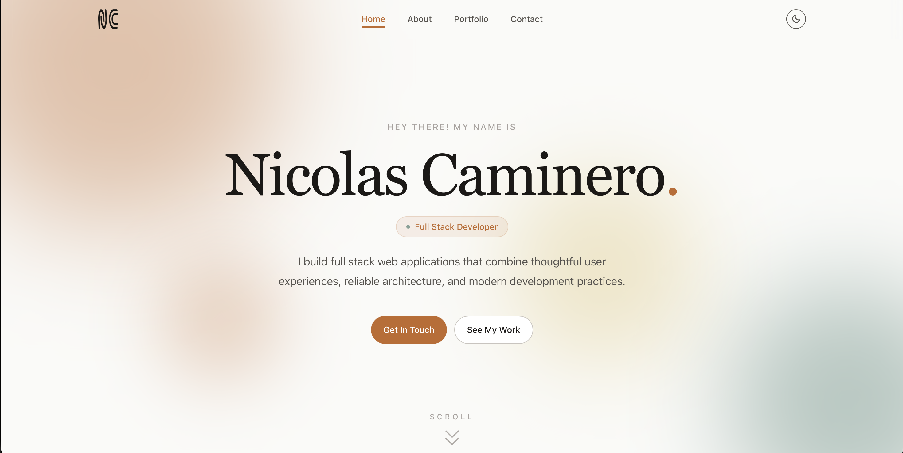

# Personal Portfolio

A modern, responsive developer portfolio built to showcase my software engineering projects, technical skills, and design experience. The site serves as a central hub for my work, provides insight into my development process, and offers an easy way for recruiters and collaborators to connect with me.

**Live Site:** https://nicolascaminero.com

## Screenshot

<p align="center">
  
</p>

## Key Features

- Built with Next.js App Router and TypeScript
- Fully responsive design for desktop and mobile devices
- Light and dark themes with smooth animated transitions
- Contact form powered by Resend
- SEO optimization with Open Graph metadata and custom social preview image
- Dockerized for reproducible development and deployment
- Automated CI pipeline with GitHub Actions
- Deployed on Vercel with automatic production deployments

## Built With

- Next.js
- React
- TypeScript
- Tailwind CSS
- Motion
- Resend
- Docker
- GitHub Actions
- Vercel

## Running Locally

Clone the repository and install dependencies:

```bash
git clone https://github.com/nerdboy626/portfolio.git
cd portfolio
npm install
```

Start the development server:

```bash
npm run dev
```

Visit http://localhost:3000.

## Running with Docker

After cloning the repository, build the Docker image:

```bash
docker build -t portfolio .
```

Run the container:

```bash
docker run -p 3000:3000 portfolio
```

Then visit http://localhost:3000.

## Deployment

The portfolio is hosted on Vercel. Every push to the main branch automatically triggers a new production deployment, while GitHub Actions verifies that the application installs correctly, passes linting and testing, builds successfully, and can create a Docker image ready for production.

## About

This portfolio was designed and developed from scratch as a personal website. While building it, I explored technologies such as Next.js App Router, TypeScript, Tailwind CSS, responsive design, accessibility, animation, SEO, CI/CD, and deployment workflows.

The site continues to evolve as I learn new technologies and build new projects.
